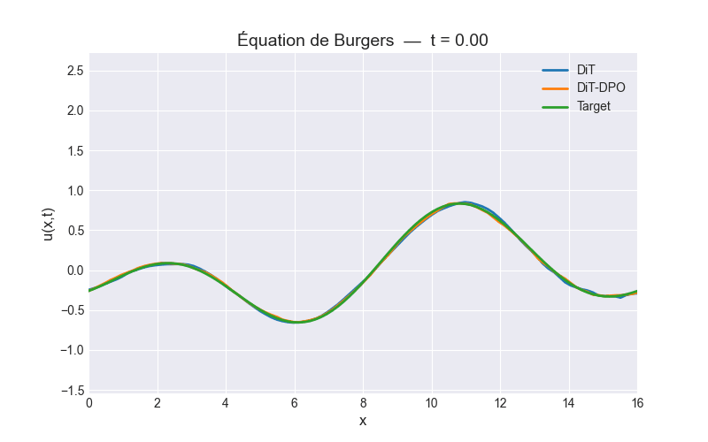

# AROMA-DPO
Deep Learning for solving PDE

## Project Overview
We introduce a novel human–machine collaborative framework that aligns predictive models with human preferences in terms of physical realism and perceptual quality. More specifically, we first pretrain an [AROMA](https://github.com/LouisSerrano/aroma/tree/main) model (a diffusion-based architecture) using the mean squared error (MSE) as the training objective. Next, to obtain physically interpretable outputs, we introduce perturbations to the inputs, generate a diverse set of prediction samples, and construct pairs of high- and low-quality predictions based on human-defined criteria, such as physical consistency (e.g., mass conservation, shock formation, boundary conditions, kinetic energy, energy spectrum... ).

Building on this, we train a preference model that learns to rank predictions generated under identical input conditions. Finally, we jointly optimize the preference model and the base predictive model: while preserving numerical accuracy, we guide the updates toward solutions that better align with human preferences and interpretability.

**Superviser**: [Patrick Gallinari](https://pages.isir.upmc.fr/gallinari/), affiliated with the Institute of Intelligent Systems and Robotics (ISIR) laboratory, and a distinguished researcher at Criteo AI Lab in Paris

## Data
We conduct experiment on Burgers dataset which can be generated from https://github.com/brandstetter-johannes/MP-Neural-PDE-Solvers. Work is ongoing to extend the approach to other datasets, such as Rayleigh–Bénard convection and [SEVIR](https://registry.opendata.aws/sevir/).

## Special Thanks

I would like to thank Patrick Gallinari, for their guidance and availability.
